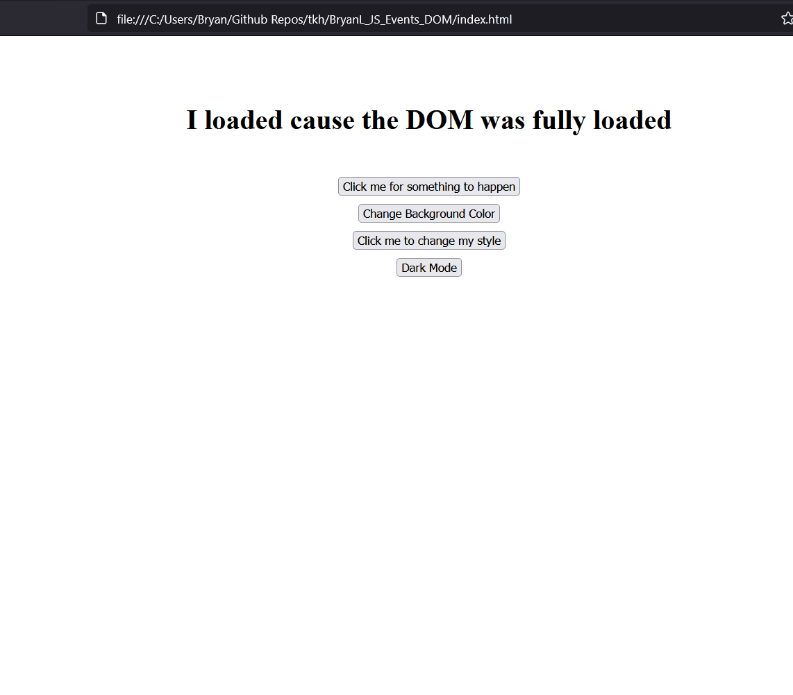

# JS DOM Events Exercises

## Overview

This lab will guide you through hands-on exercises with JavaScript DOM events, demonstrating how to handle key events, clicks, and other interactions in the browser using JavaScript. You will create and interact with various elements, learning to manipulate them dynamically based on user actions.

## Exercises

### 1. DOMContentLoaded Event

    When the DOM is fully loaded, change the content of an element with the id onload to display a message.

### 2. Keydown Event

    Capture key presses and display the pressed key code in an element with the id direction.

### 3. Click Event

    Add a click event listener to a button with the id clickMe that changes its text to “You clicked me!”

### 4. Random Background Color

    Create a button with the id randomColorBtn. When clicked, change the page's background to a random color using JavaScript.

### 5. Class Toggle on Click

    Style a button and toggle a glow effect using classList.toggle() each time the button is clicked.

### 6. Dark Mode Toggle

    Create a button that switches the page between light and dark modes when clicked. Use classList to toggle the background and text colors.

### 7. To-Do List

    Build a basic to-do list application that allows users to add tasks dynamically. Add functionality to toggle task completion by clicking on the task.

## Preview

### 1 - 6 Exercises:

### To-Do List Exercise:

